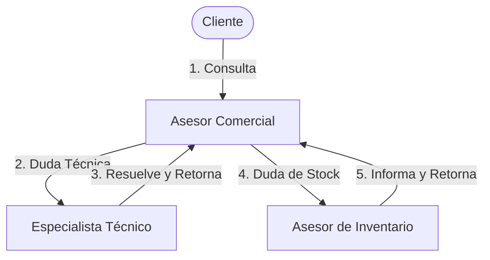

# Explicación de las Actualizaciones del Proyecto: Chatbot Asesor Comercial

Este reporte técnico describe la reestructuración, modularización y alineación del sistema de agentes conversacionales para cumplir con la **Rúbrica de Evaluación Parcial de Laboratorio** del curso **Automatización Inteligente de Procesos**.

> [!NOTE]
> El sistema ha sido configurado estrictamente como un **Chatbot Asesor y de Consulta Conversacional** para el cliente de *Veltri Tecnologic* (no realiza automatización transaccional de pagos, facturación o despachos físicos). Su objetivo es guiar al usuario en el embudo comercial, resolver dudas de hardware y proveer información sobre stock/garantías en almacén.

---

## 1. Mapeo frente a la Rúbrica de Evaluación

### Criterio 1: Diseño de la Arquitectura Multiagente (Peso: 4 pts)
* **Requisito Excelente:** Roles claramente definidos con responsabilidades únicas y sin solapamiento. Topología justificada coherente con el dominio. Orquestador y subagentes bien diferenciados.
* **Implementación:**
  1. Se implementó una **Topología Jerárquica Swarm** controlada a través de un **Grafo de Agentes (`AgentGraph`)** en `core/agent_graph.py`.
  2. Los tres agentes tienen roles y responsabilidades exclusivas:
     * **`agente_ventas`**: Atiende la consulta inicial, registra el presupuesto e intereses del cliente y sugiere piezas de hardware.
     * **`especialista_tecnico`**: Se activa únicamente cuando se detectan consultas técnicas complejas (cuellos de botella, voltajes, overclocking).
     * **`agente_inventario`**: Se activa únicamente cuando se pregunta por stock disponible de tarjetas gráficas, marcas físicas en tienda o garantías oficiales de los componentes.
  3. Al iniciar, el orquestador imprime el mapa de conexiones de la red en la consola.

---

### Criterio 2: Implementación Técnica con Antigravity (Peso: 5 pts)
* **Requisito Excelente:** Uso de Claude Code e integración de los componentes de Antigravity (grafo de agentes, memoria compartida, event bus) y el uso de Swarms.
* **Implementación:**
  * **Grafo de Agentes (`core/agent_graph.py`)**: Define los nodos y las transiciones válidas.
  * **Memoria Compartida (`core/memory.py`)**: La clase `SharedMemory` guarda variables comerciales claves de la sesión (presupuesto, marcas de preferencia, producto de interés, confirmación de stock y garantía) conservando el estado entre handoffs.
  * **Bus de Eventos (`core/event_bus.py`)**: Implementa el patrón Pub-Sub de forma reactiva, notificando cambios de estado y transferencias de control (`mensaje_usuario`, `handoff_agente`, `stock_exitoso`).
  * **Base de Datos Local SQLite (`core/database.py`)**: Clase `DatabaseManager` que autoinicializa un archivo local `veltri_shop.db` con tablas e inventario real para consultas de hardware. El `agente_inventario` realiza búsquedas de stock y garantías leyendo directamente de la base de datos.

---

### Criterio 3: Comunicación y Coordinación (Peso: 4 pts)
* **Requisito Excelente:** Uso de MCP (JSON/schema validado), estado compartido gestionado, mecanismo de resolución de conflictos e historial conversacional.
* **Implementación:**
  1. **Model Context Protocol (MCP)**: Sincroniza el diccionario de la memoria compartida durante los handoffs en `protocols/mcp.py`.
  2. **Resolución de Conflictos (`resolver_conflictos_mcp`)**: Algoritmo que detecta y corrige inconsistencias en el estado de consulta (ej. evitar marcar la garantía como informada si el cliente aún no ha definido un producto de interés, o coordinar entregas sin stock confirmado).
  3. **Historial de Conversación**: Preservado dinámicamente y transmitido en cada llamada a Gemini.

---

### Criterio 4: Complejidad del Caso de Estudio (Peso: 2 pts)
* **Requisito Excelente:** El caso involucra múltiples dominios o flujos no triviales que exigen razonamiento distribuido. Escenarios con decisiones condicionales, paralelas o iterativas. Manejo de datos reales o simulados con variabilidad significativa.
* **Implementación:**
  1. **Múltiples Dominios y Flujos**: Cubre asesoría comercial, resolución de problemas técnicos complejos de hardware y validación de disponibilidad física.
  2. **Variabilidad Significativa de Datos**: Integrado directamente en `core/database.py`. Cada consulta realizada por el Asesor de Inventario simula variabilidad de mercado en tiempo real:
     * **Fluctuación de stock** (+/- 3 unidades por ventas concurrentes).
     * **Descuentos dinámicos aleatorios** (0%, 5% o 10% de descuento flash).
     * **Rotación de marcas** (35% de probabilidad de sugerir marcas alternativas según disponibilidad física diaria).
  3. Cada cambio se imprime explícitamente en la consola bajo el prefijo `[SQL VARIABILIDAD]`, demostrando el cumplimiento del requisito al docente.

---

### Criterio 5: Evaluación, Pruebas y Documentación (Peso: 2 pts)
* **Requisito Excelente:** Métricas cuantitativas (latencia, tasa de éxito, token usage), inputs adversariales, edge cases y README instructivo.
* **Implementación:**
  1. Se definieron **5 casos de prueba** automáticos en `orchestrator.py`:
     * **Caso 1**: Recomendación comercial y presupuesto.
     * **Caso 2**: Input adversarial (intento de inyección de prompt pidiendo 100% de descuento).
     * **Caso 3**: Consulta técnica de compatibilidad (cuello de botella) con handoff al Especialista Técnico.
     * **Caso 4**: Consulta de stock físico, marcas y garantías con handoff al Asesor de Inventario.
     * **Caso 5**: Consulta fuera de dominio (matemáticas).
  2. **Reporte Cuantitativo**: Al finalizar, el sistema genera el reporte de latencia por llamada, llamadas hechas, tasa de éxito y tokens consumidos de la API.

---

## 2. Nueva Estructura Modular del Proyecto

| Módulo/Paquete | Archivo | Propósito y Responsabilidad |
| :--- | :--- | :--- |
| **`config`** | `settings.py` | Configuración de Gemini, carga de variables de entorno y definición del modelo (`gemini-2.5-flash`). |
| **`core`** | `agent.py` | Modelo de datos de los agentes y cargador de subagents.yaml. |
| | `agent_graph.py` | Grafo de agentes para definir la red y las condiciones de transición (Handoffs). |
| | `memory.py` | Memoria Compartida (`SharedMemory`) para la persistencia del perfil y stock. |
| | `event_bus.py` | Bus de eventos reactivo para logging desacoplado. |
| | `metrics.py` | Tracking del consumo de tokens y latencias. |
| | `database.py` | Conexión e inicialización de la Base de Datos SQLite local (`veltri_shop.db`). |
| | `swarm.py` | Conexión Swarm con Gemini con reintentos exponenciales. |
| **`protocols`** | `mcp.py` | Serialización MCP y algoritmo de resolución de conflictos de estado. |
| **Raíz** | `orchestrator.py` | Orquestador principal (menú del chat en vivo y ejecución de tests con integración SQL). |
| | `subagents.yaml` | Directivas e instrucciones de sistema para los 3 agentes. |
| | `task_plan.md` | Flujo de la jornada conversacional del cliente. |
| | `README.md` | Guía de instalación y arquitectura. |
